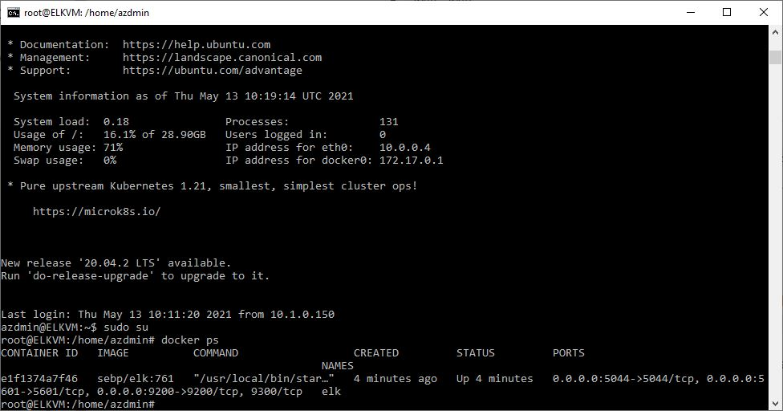

# ## Automated ELK Stack Deployment

The files in this repository were used to configure the network depicted below.


These files have been tested and used to generate a live ELK deployment on Azure. They can be used to either recreate the entire deployment pictured above. Alternatively, select portions of the playbook file may be used to install only certain pieces of it, such as Filebeat.

[install_elk.yml](Playbooks/install-elk.yml)

 ```
# install_elk.yml
- name: Configure Elk VM with Docker
 hosts: elk
 remote_user: azadmin
 become: true
 tasks:
   # Use apt module
   - name: Install docker.io
     apt:
       update_cache: yes
       name: docker.io
       state: present

     # Use apt module
   - name: Install pip3
     apt:
       force_apt_get: yes
       name: python3-pip
       state: present

     # Use pip module
   - name: Install Docker python module
     pip:
       name: docker
       state: present

     # Use command module
   - name: Increase virtual memory
     command: sysctl -w vm.max_map_count=262144

     # Use sysctl module
   - name: Use more memory
     sysctl:
       name: vm.max_map_count
       value: "262144"
       state: present
       reload: yes

     # Use docker_container module
   - name: download and launch a docker elk container
     docker_container:
       name: elk
       image: sebp/elk:761
       state: started
       restart_policy: always
       published_ports:
         - 5601:5601
         - 9200:9200
         - 5044:5044

      # Use systemd module
    - name: Enable service docker on boot
      systemd:
        name: docker
        enabled: yes
         
 ```

This document contains the following details:
- Description of the Topologu
- Access Policies
- ELK Configuration
  - Beats in Use
  - Machines Being Monitored
- How to Use the Ansible Build


### Description of the Topology

The main purpose of this network is to expose a load-balanced and monitored instance of DVWA, the D*mn Vulnerable Web Application.

Load balancing ensures that the application will be highly available, in addition to restricting inbound access to the network.
- _TODO: What aspect of security do load balancers protect? What is the advantage of a jump box?
A load balancer will route client requests across all servers that are capable of fullfilling those requests in a manner that maximizes speed aand capacity to ensure that no one server is overworked. if one server goes offline, the load balancer will redirect the traffic to the remaining servers. In the situation of a DDoS attack, the load balancer will shift the traffic to another server.

Integrating an ELK server allows users to easily monitor the vulnerable VMs for changes to the logs and system metrics.
- _TODO: What does Filebeat watch for? Filebeat monitor log files or locations, collects events and forward them to Elasticsearch or Logstash for indexing.
- _TODO: What does Metricbeat record? Metricbeat records metrics from the system and from services running on the server and forward them to Elasticsearch opr Logstash.

The configuration details of each machine may be found below.
_Note: Use the [Markdown Table Generator](http://www.tablesgenerator.com/markdown_tables) to add/remove values from the table_.

| Name     | Function | IP Address | Operating System |
|----------|----------|------------|------------------|
| Jump Box | Gateway  | 10.0.0.1   | Linux            |
| Web-1    | Server   | 10.1.0.160 | Linux            |
| Web-2    | Server   | 10.1.0.170 | Linux            |
| ELKVM    | Log Server   | 10.0.0.4    | Linux                 |

### Access Policies

The machines on the internal network are not exposed to the public Internet. 

Only the jumpbox machine can accept connections from the Internet. Access to this machine is only allowed from the following IP addresses:
-Personal IP 119.18.1.27

Machines within the network can only be accessed by Jumpbox.
- _TODO: Which machine did you allow to access your ELK VM? What was its IP address?_
Only the Jumpbox has access to the ELKVM, the Jumpbox IP address is 10.0.0.1 and the ELKVM is 10.0.0.4
A summary of the access policies in place can be found in the table below.

| Name     | Publicly Accessible | Allowed IP Addresses |
|----------|---------------------|----------------------|
| Jump Box | Yes              | Personal    |
|     Load Balancer     |       yes              |         open             |
|       Web-1   |             No        |           10.0.0.1           |
| Web-2 | No | 10.0.0.1|
| ELKVM | No | 10.0.0.1 |

### Elk Configuration

Ansible was used to automate configuration of the ELK machine. No configuration was performed manually, which is advantageous because...
- _TODO: What is the main advantage of automating configuration with Ansible?
 - automate configuration will save time
 - multiple tasks can be perfomred at the same time
 - reduces configuration errors
 - can limit running services
 - application intallation can be streamlined

The playbook implements the following tasks:
- _TODO: In 3-5 bullets, explain the steps of the ELK installation play. E.g., install Docker; download image; etc._
 - The playbook installs docker.io: installs docker to the server
 - Install Python3_pip: Python3_pip allows additional docker to be installed without errors
 - Install docker python module: Installs the required docker modules
 - Increase memory: Fix low in memory issues with the ELKVM
 - Download and launch ELK Container: downloads the ELK container and launches it with the 5601 port.

The following screenshot displays the result of running `docker ps` after successfully configuring the ELK instance.



### Target Machines & Beats
This ELK server is configured to monitor the following machines:
- _TODO: List the IP addresses of the machines you are monitoring_
 - 10.1.0.160
 - 10.1.0.170
We have installed the following Beats on these machines:
- _TODO: Specify which Beats you successfully installed_
- Metricbeat and filebeat

These Beats allow us to collect the following information from each machine:
- _TODO: In 1-2 sentences, explain what kind of data each beat collects, and provide 1 example of what you expect to see. E.g., `Winlogbeat` collects Windows logs, which we use to track user logon events, etc._
 - Filebeat collects data about the filesystem. An example is system filebeat module which collects logs generated by the system logging service. 
 - Metricbeat collects machine metices, for example uptime and system metrics. System metrics will collect data on CPU, memory, network and disk statisticsfrom host machine.
 
### Using the Playbook
In order to use the playbook, you will need to have an Ansible control node already configured. Assuming you have such a control node provisioned: 

SSH into the control node and follow the steps below:
- Copy the configuration file to the ansible container "~/etc/ansible".
- Update the hosts file to include the IP address of the ELKVM ansible_python_interpreter=/usr/bin/python3
- Run the playbook, and navigate to http://20.39.45.144:5601/app/kibana to check that the installation worked as expected.

_TODO: Answer the following questions to fill in the blanks:_
- _Which file is the playbook? Where do you copy it?_ Files that has a ".yml" extension are ansible playbook files and are copied into the ansible container. 
- _Which file do you update to make Ansible run the playbook on a specific machine? How do I specify which machine to install the ELK server on versus which to install Filebeat on?_ The hosts file needs to be update to include the IP address of the machines where the ansible container is to be installed. The playbook files can be updated to specify different group of machines and different users you want to install the ansible playbook on.
- _Which URL do you navigate to in order to check that the ELK server is running?
http://20.39.45.144:5601/app/kibana
_As a **Bonus**, provide the specific commands the user will need to run to download the playbook, update the files, etc._

  - SSH into the Jumbox Machine and run the ansible ontainer.
  - Enter the command: curl https://github.com/sulfur3214/Cybersecurity/blob/a39fce524f76979cd39ef57d48527384b93ef5e8/Playbooks/install-elk.yml > /etc/ansible/roles/elk_install.yml
  - Edit the Hosts file to include the IP address for the ELKVM
  - To run the Playbook: ansible-playbook /etc/ansible/elk_install.yml
  - http://[your_elk_server_ip]:5601/app/kibanaerify the installation is working by going to http://[your_elk_server_ip]:5601/app/kibana
